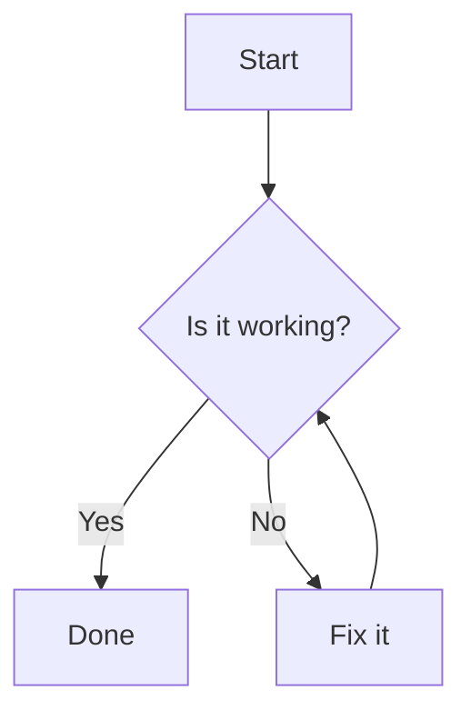

# Mermaid Markdown Bridge

[](https://github.com/zhongmiao-org/mermaid-markdown-bridge/actions/workflows/build.yml)
[](https://github.com/zhongmiao-org/mermaid-markdown-bridge/actions/workflows/changelog.yml)
[](https://github.com/zhongmiao-org/mermaid-markdown-bridge/releases)
[](./LICENSE)


[中文文档](./README_zh.md)

Render Mermaid code blocks directly inside the built-in JetBrains Markdown Preview.

Mermaid Markdown Bridge is a small JetBrains IDE plugin for Markdown authors who want diagrams to appear in preview without switching editors or installing a separate Mermaid language plugin. The MVP focuses only on preview rendering: it does not add Mermaid PSI, inspections, completion, intentions, or custom editors.

## Features

- Renders fenced Mermaid code blocks in JetBrains Markdown Preview.
- Supports common Mermaid diagrams such as `flowchart TD` and `sequenceDiagram`.
- Works by extending the JetBrains Markdown preview browser layer, keeping the regular Markdown editor and preview panel intact.
- Bundles Mermaid runtime resources with the plugin, so no extra Mermaid plugin is required.
- Adapts the Mermaid theme to the IDE light or dark theme.
- Leaves normal Markdown code blocks untouched.

## Usage

Write a regular Mermaid fenced code block in a Markdown file:

````markdown

````

Open the file in a supported JetBrains IDE and switch to Markdown Preview. The Mermaid block is converted into a diagram in the preview pane.

See [examples/demo.md](./examples/demo.md) for flowchart and sequence diagram examples.

## Installation

The plugin is not yet listed on JetBrains Marketplace.

For now, install a ZIP from GitHub Releases:

1. Download the latest plugin ZIP from [GitHub Releases](https://github.com/zhongmiao-org/mermaid-markdown-bridge/releases).
2. In the IDE, open `Settings/Preferences` > `Plugins`.
3. Open the gear menu and choose `Install Plugin from Disk...`.
4. Select the downloaded ZIP and restart the IDE when prompted.

## Compatibility

- Target platform: IntelliJ Platform `2025.2`.
- Primary IDE targets: IntelliJ IDEA Community and WebStorm.
- Required bundled plugin: JetBrains Markdown plugin (`org.intellij.plugins.markdown`).
- Preview engine: JCEF-based Markdown Preview.

## Known Limitations

- Compose Markdown Preview may not load the browser extension script.
- Mermaid language services are out of scope for the MVP.
- `.mmd` and `.mermaid` file types are not registered.
- Syntax highlighting, completion, inspections, intentions, and settings UI are not included.
- Marketplace badges will be added after the plugin receives a JetBrains Marketplace plugin ID.

## Development

Run tests:

```shell
./gradlew test
```

Build the plugin:

```shell
./gradlew build
```

Start a sandbox IDE:

```shell
./gradlew runIde
```

## License

This project is licensed under the [MIT License](./LICENSE).
