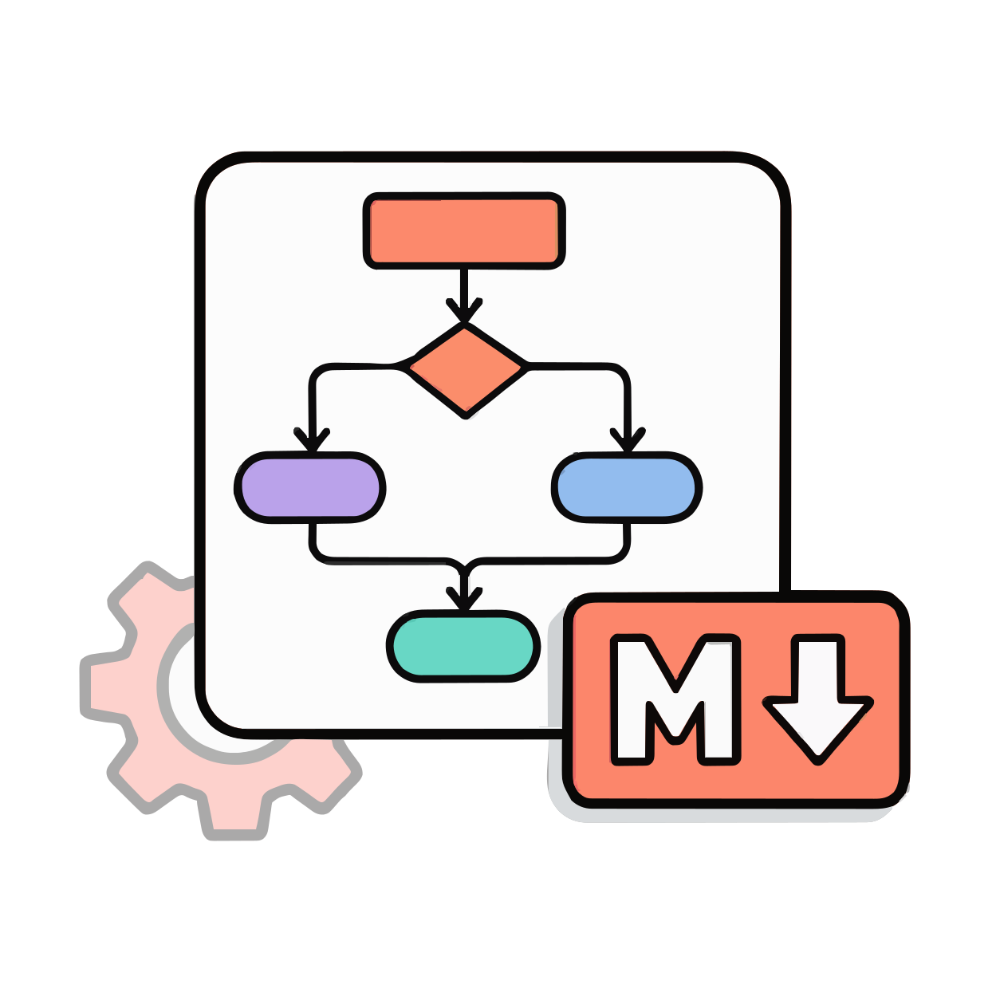
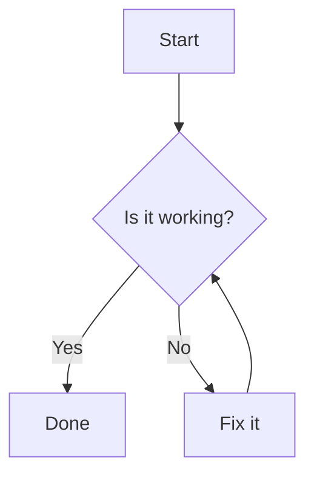

<div align="center">

<p>
  <picture>
    <source media="(prefers-color-scheme: dark)" srcset="./src/main/resources/META-INF/brand/md-dark.svg" />
    <source media="(prefers-color-scheme: light)" srcset="./src/main/resources/META-INF/brand/md.svg" />
    
  </picture>
  <picture>
    <source media="(prefers-color-scheme: dark)" srcset="./src/main/resources/META-INF/brand/plus-dark.svg" />
    <source media="(prefers-color-scheme: light)" srcset="./src/main/resources/META-INF/brand/plus-light.svg" />
    
  </picture>
  
  <picture>
    <source media="(prefers-color-scheme: dark)" srcset="./src/main/resources/META-INF/brand/equal-dark.svg" />
    <source media="(prefers-color-scheme: light)" srcset="./src/main/resources/META-INF/brand/equal-light.svg" />
    
  </picture>
  
</p>

# Mermaid Markdown Bridge

[](https://github.com/zhongmiao-org/mermaid-markdown-bridge/actions/workflows/build.yml)
[](https://github.com/zhongmiao-org/mermaid-markdown-bridge/actions/workflows/changelog.yml)
[](https://github.com/zhongmiao-org/mermaid-markdown-bridge/releases)
[](https://plugins.jetbrains.com/plugin/31518-mermaid-markdown-bridge)
[](https://plugins.jetbrains.com/plugin/31518-mermaid-markdown-bridge)
[](https://github.com/zhongmiao-org/mermaid-markdown-bridge/issues)
[](./LICENSE)
[](https://github.com/mermaid-js/mermaid/releases/tag/mermaid%4011.15.0)


English | [简体中文](./README_zh.md)

</div>

<!-- Plugin description -->

Render Mermaid fenced code blocks directly inside the built-in JetBrains Markdown Preview.

Mermaid Markdown Bridge is a JetBrains IDE Markdown Preview extension package. It extends the official JetBrains Markdown plugin preview so Markdown authors can see Mermaid diagrams in the preview pane without switching editors, installing a separate Mermaid language plugin, or replacing the IDE's Markdown tooling.

The project is intentionally narrow: it is a preview rendering bridge for Mermaid fenced code blocks. It is not a Mermaid language support plugin, not a standalone diagram editor, and not a replacement for JetBrains Markdown Preview. The goal is to make Mermaid diagrams feel natural in the existing Markdown Preview, with a rendering style that stays close to the familiar GitHub Markdown and Mermaid preview experience.

- Renders fenced `mermaid` code blocks in Markdown Preview.
- Bundles the Mermaid runtime locally for diagram rendering.
- Adapts Mermaid output to the IDE light or dark theme.
- Supports preview controls: hold `Control` / `Command` and use the mouse wheel over a diagram to zoom, then drag the diagram to pan.
- Keeps the rendered diagram experience close to familiar GitHub Markdown and Mermaid previews.
- Does not add Mermaid language services, syntax highlighting, completion, inspections, or `.mmd`/`.mermaid` file type support.

<!-- Plugin description end -->

## Project Goal

JetBrains IDEs already include a strong Markdown editor and preview experience, but Mermaid diagrams normally need extra preview support. This plugin fills that gap by adding Mermaid rendering to Markdown Preview while keeping the existing editor, preview panel, shortcuts, and Markdown plugin behavior intact.

The MVP focuses on the most common Markdown authoring workflow:

1. Write a fenced `mermaid` code block in a Markdown file.
2. Open the built-in Markdown Preview.
3. See the block rendered as a Mermaid diagram.

## Features

- Renders fenced Mermaid code blocks in JetBrains Markdown Preview.
- Supports common Mermaid diagrams such as `flowchart TD` and `sequenceDiagram`.
- Works by extending the JetBrains Markdown preview browser layer, keeping the regular Markdown editor and preview panel intact.
- Bundles Mermaid runtime resources with the plugin, so no extra Mermaid plugin is required.
- Adapts the Mermaid theme to the IDE light or dark theme.
- Supports direct diagram preview controls with `Control` / `Command` + mouse wheel zoom and drag-to-pan.
- Keeps normal Markdown code blocks untouched.
- Keeps the rendered preview visually familiar for users who expect GitHub-style Markdown diagrams.

## How It Works

The plugin depends on the JetBrains Markdown plugin (`org.intellij.plugins.markdown`) and contributes a browser preview extension through `org.intellij.markdown.browserPreviewExtensionProvider`.

At preview time, the extension injects:

- the bundled Mermaid runtime from the plugin resources;
- a small bridge script that scans the preview DOM for Mermaid code fences;
- initialization code that runs Mermaid with `startOnLoad: false` and a theme selected from the current IDE light or dark theme.

The bridge only transforms Markdown preview HTML that represents Mermaid fenced code blocks, such as `pre > code.language-mermaid`. It reads the source through `textContent`, so HTML entities such as `&gt;`, `&lt;`, and `&amp;` are decoded before Mermaid receives the diagram text. Regular code blocks are left as regular code blocks.

The extension also marks pending and rendered Mermaid nodes to avoid duplicate rendering when the preview refreshes or the DOM changes.

## Usage

Write a regular Mermaid fenced code block in a Markdown file:

````markdown

````

Open the file in a supported JetBrains IDE and switch to Markdown Preview. The Mermaid block is converted into a diagram in the preview pane.

See [examples/demo.md](./examples/demo.md) for examples covering flowchart, sequence, gantt, class, state, pie, git graph, user journey, and C4 diagrams.

## Diagram Controls

Rendered Mermaid diagrams support basic preview navigation without changing the Markdown editor or the surrounding preview page:

- Hold `Control` / `Command` and use the mouse wheel over a diagram to zoom in or out.
- Drag the rendered diagram to pan around the current diagram view.
- Use the on-diagram controls to zoom, pan, or reset the diagram view.

## Scope

This extension package only enhances the official JetBrains Markdown Preview rendering path. It intentionally does not include:

- `.mmd` or `.mermaid` file type registration;
- Mermaid syntax highlighting;
- completion, inspections, intentions, or quick fixes;
- settings UI;
- a custom editor or custom Markdown preview panel.

Markdown editing, Markdown parsing, preview layout, and the surrounding preview UI remain owned by the JetBrains Markdown plugin.

## Installation

Install the plugin from [JetBrains Marketplace](https://plugins.jetbrains.com/plugin/31518-mermaid-markdown-bridge), or install a ZIP from GitHub Releases:

1. In the IDE, open `Settings/Preferences` > `Plugins`.
2. Search for `Mermaid Markdown Bridge` in Marketplace and install it.
3. Restart the IDE when prompted.

For manual installation, download the latest plugin ZIP from [GitHub Releases](https://github.com/zhongmiao-org/mermaid-markdown-bridge/releases), then use the plugin gear menu and choose `Install Plugin from Disk...`.

## Third-Party Runtime

This plugin bundles Mermaid for local preview rendering:

- Project: Mermaid
- Website: https://mermaid.js.org/
- Source: https://github.com/mermaid-js/mermaid
- License: MIT License
- Bundled file: `src/main/resources/mermaid/mermaid.min.js`

Mermaid is used only inside the JetBrains Markdown Preview browser context to render Mermaid fenced code blocks. Mermaid Markdown Bridge does not use Mermaid to collect, upload, or transfer user data.

## Compatibility

- Target IDEs: JetBrains IDEs based on IntelliJ Platform `2023.1+`.
- Verified IDEs: IntelliJ IDEA Community/Ultimate, WebStorm, PhpStorm, PyCharm Community/Professional, GoLand, CLion, DataGrip, DataSpell, Rider, and RubyMine.
- Required bundled plugin: JetBrains Markdown plugin (`org.intellij.plugins.markdown`).
- Preview engine: JCEF-based Markdown Preview.

## Known Limitations

- Compose Markdown Preview may not load the browser extension script.
- Mermaid language services are out of scope for the MVP.
- `.mmd` and `.mermaid` file types are not registered.
- Syntax highlighting, completion, inspections, intentions, and settings UI are not included.
- JetBrains Marketplace page: https://plugins.jetbrains.com/plugin/31518-mermaid-markdown-bridge

## Release Process

Releases are prepared through GitHub Actions:

1. Run the `Prepare Release` workflow and enter the target version, such as `0.2.0`.
2. The workflow reads the English and Chinese `Unreleased` changelog sections, updates `gradle.properties`, archives both changelogs, and opens a release PR.
3. Review and merge the release PR.
4. The release CI creates the matching `vX.Y.Z` tag on the merged `main` commit, builds the plugin, publishes it to JetBrains Marketplace, uploads the ZIP to GitHub Releases, and publishes the draft release.

Marketplace publishing uses the `PUBLISH_TOKEN` GitHub Actions secret. The release workflow also references signing secrets for the plugin artifact, so the repository secrets must stay in sync with the workflow before a real Marketplace upload.

## Development

Run tests:

```shell
./gradlew test
```

Build the plugin:

```shell
./gradlew build
```

Build the distributable plugin ZIP:

```shell
./gradlew buildPlugin
```

Start a sandbox IDE:

```shell
./gradlew runIde
```

## License

This project is licensed under the [MIT License](./LICENSE).
