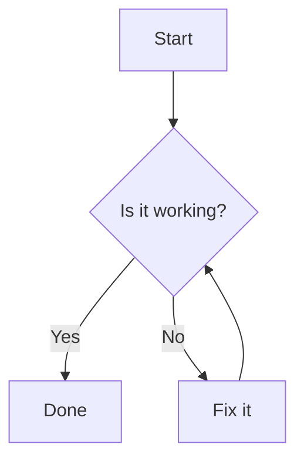

# Mermaid Markdown Bridge

[](https://github.com/zhongmiao-org/mermaid-markdown-bridge/actions/workflows/build.yml)
[](https://github.com/zhongmiao-org/mermaid-markdown-bridge/actions/workflows/changelog.yml)
[](https://github.com/zhongmiao-org/mermaid-markdown-bridge/releases)
[](./LICENSE)


[中文文档](./README_zh.md)

Render Mermaid code blocks directly inside the built-in JetBrains Markdown Preview.

Mermaid Markdown Bridge is a JetBrains IDE Markdown Preview extension package. It extends the bundled JetBrains Markdown Preview so Markdown authors can see Mermaid diagrams in the preview pane without switching editors, installing a separate Mermaid language plugin, or replacing the IDE's Markdown tooling.

The project is intentionally narrow: it is a preview rendering bridge for Mermaid fenced code blocks. It is not a Mermaid language support plugin, not a standalone diagram editor, and not a replacement for JetBrains Markdown Preview.

## Project Goal

JetBrains IDEs already include a strong Markdown editor and preview experience, but Mermaid diagrams normally need extra preview support. This plugin fills that gap by adding Mermaid rendering to Markdown Preview while keeping the existing editor, preview panel, shortcuts, and Markdown plugin behavior intact.

The MVP focuses on the most common Markdown authoring workflow:

1. Write a fenced `mermaid` code block in a Markdown file.
2. Open the built-in Markdown Preview.
3. See the block rendered as a Mermaid diagram.

## Features

- Renders fenced Mermaid code blocks in JetBrains Markdown Preview.
- Supports common Mermaid diagrams such as `flowchart TD` and `sequenceDiagram`.
- Works by extending the JetBrains Markdown preview browser layer, keeping the regular Markdown editor and preview panel intact.
- Bundles Mermaid runtime resources with the plugin, so no extra Mermaid plugin is required.
- Adapts the Mermaid theme to the IDE light or dark theme.
- Adds per-diagram zoom, reset, and drag-to-pan controls in Markdown Preview.
- Leaves normal Markdown code blocks untouched.

## How It Works

The plugin depends on the JetBrains Markdown plugin (`org.intellij.plugins.markdown`) and contributes a browser preview extension through `org.intellij.markdown.browserPreviewExtensionProvider`.

At preview time, the extension injects:

- the bundled Mermaid runtime from the plugin resources;
- a small bridge script that scans the preview DOM for Mermaid code fences;
- initialization code that runs Mermaid with `startOnLoad: false` and a theme selected from the current IDE light or dark theme.

The bridge only transforms Markdown preview HTML that represents Mermaid fenced code blocks, such as `pre > code.language-mermaid`. It reads the source through `textContent`, so HTML entities such as `&gt;`, `&lt;`, and `&amp;` are decoded before Mermaid receives the diagram text. Regular code blocks are left as regular code blocks.

The extension also marks pending and rendered Mermaid nodes to avoid duplicate rendering when the preview refreshes or the DOM changes.

## Usage

Write a regular Mermaid fenced code block in a Markdown file:

````markdown

````

Open the file in a supported JetBrains IDE and switch to Markdown Preview. The Mermaid block is converted into a diagram in the preview pane.

See [examples/demo.md](./examples/demo.md) for flowchart and sequence diagram examples.

## Scope

This extension package only enhances Markdown Preview rendering. It intentionally does not include:

- `.mmd` or `.mermaid` file type registration;
- Mermaid syntax highlighting;
- completion, inspections, intentions, or quick fixes;
- settings UI;
- a custom editor or custom Markdown preview panel.

## Installation

The plugin is not yet listed on JetBrains Marketplace.

For now, install a ZIP from GitHub Releases:

1. Download the latest plugin ZIP from [GitHub Releases](https://github.com/zhongmiao-org/mermaid-markdown-bridge/releases).
2. In the IDE, open `Settings/Preferences` > `Plugins`.
3. Open the gear menu and choose `Install Plugin from Disk...`.
4. Select the downloaded ZIP and restart the IDE when prompted.

## Marketplace Discovery

JetBrains IDEs cannot reliably recommend this plugin before it is installed just because a Markdown file contains a fenced `mermaid` code block. Marketplace plugin recommendations are based on JetBrains-supported feature signals such as file types, run configuration types, facets, module types, artifact types, and dependency support. Markdown files are already handled by the bundled JetBrains Markdown plugin, so this extension package does not register `.md` as its own file type.

## Compatibility

- Target platform: IntelliJ Platform `2025.2`.
- Primary IDE targets: IntelliJ IDEA Community and WebStorm.
- Required bundled plugin: JetBrains Markdown plugin (`org.intellij.plugins.markdown`).
- Preview engine: JCEF-based Markdown Preview.

## Known Limitations

- Compose Markdown Preview may not load the browser extension script.
- Mermaid language services are out of scope for the MVP.
- `.mmd` and `.mermaid` file types are not registered.
- Syntax highlighting, completion, inspections, intentions, and settings UI are not included.
- Marketplace badges will be added after the plugin receives a JetBrains Marketplace plugin ID.

## Release Process

Releases are prepared through GitHub Actions:

1. Run the `Prepare Release` workflow and enter the target version, such as `0.2.0`.
2. The workflow reads the English and Chinese `Unreleased` changelog sections, updates `gradle.properties`, archives both changelogs, and opens a release PR.
3. Review and merge the release PR.
4. The release CI creates the matching `vX.Y.Z` tag on the merged `main` commit, builds the plugin, publishes it to JetBrains Marketplace, uploads the ZIP to GitHub Releases, and publishes the draft release.

Marketplace publishing uses the `PUBLISH_TOKEN` GitHub Actions secret. The release workflow also references signing secrets for the plugin artifact, so the repository secrets must stay in sync with the workflow before a real Marketplace upload.

## Development

Run tests:

```shell
./gradlew test
```

Build the plugin:

```shell
./gradlew build
```

Build the distributable plugin ZIP:

```shell
./gradlew buildPlugin
```

Start a sandbox IDE:

```shell
./gradlew runIde
```

## License

This project is licensed under the [MIT License](./LICENSE).
