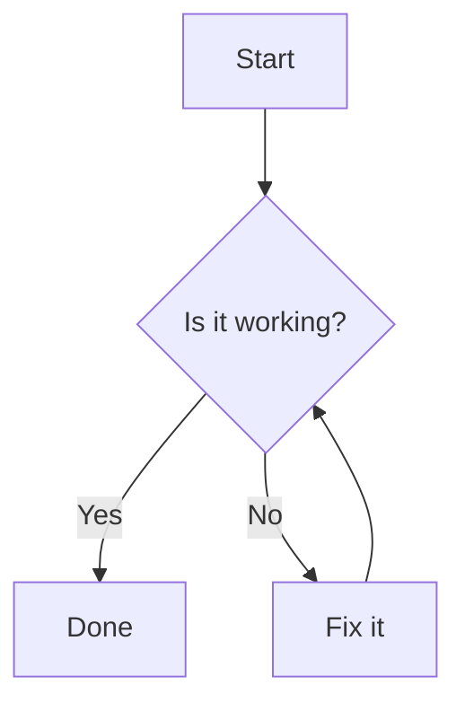

<div align="center">

<p>
  <picture>
    <source media="(prefers-color-scheme: dark)" srcset="./src/main/resources/META-INF/brand/md-dark.svg" />
    <source media="(prefers-color-scheme: light)" srcset="./src/main/resources/META-INF/brand/md.svg" />
    
  </picture>
  <picture>
    <source media="(prefers-color-scheme: dark)" srcset="./src/main/resources/META-INF/brand/plus-dark.svg" />
    <source media="(prefers-color-scheme: light)" srcset="./src/main/resources/META-INF/brand/plus-light.svg" />
    
  </picture>
  
  <picture>
    <source media="(prefers-color-scheme: dark)" srcset="./src/main/resources/META-INF/brand/equal-dark.svg" />
    <source media="(prefers-color-scheme: light)" srcset="./src/main/resources/META-INF/brand/equal-light.svg" />
    
  </picture>
  
</p>

# Mermaid Markdown Bridge

[](https://github.com/zhongmiao-org/mermaid-markdown-bridge/actions/workflows/build.yml)
[](https://github.com/zhongmiao-org/mermaid-markdown-bridge/actions/workflows/changelog.yml)
[](https://github.com/zhongmiao-org/mermaid-markdown-bridge/releases)
[](https://plugins.jetbrains.com/plugin/31518-mermaid-markdown-bridge)
[](https://plugins.jetbrains.com/plugin/31518-mermaid-markdown-bridge)
[](https://github.com/zhongmiao-org/mermaid-markdown-bridge/issues)
[](./LICENSE)
[](https://github.com/mermaid-js/mermaid/releases/tag/mermaid%4011.15.0)


[English](./README.md) | 简体中文

</div>

在 JetBrains IDE 自带 Markdown Preview 中直接渲染 Mermaid code block。

Mermaid Markdown Bridge 是一个 JetBrains IDE Markdown Preview 扩展包。它增强 JetBrains 官方 Markdown 插件的 Preview，让 Markdown 作者可以直接在预览面板中查看 Mermaid 图表，而不需要切换编辑器、安装额外 Mermaid 语言插件，或替换 IDE 原有 Markdown 能力。

项目边界刻意保持很小：它只是 Mermaid fenced code block 的预览渲染桥接层，不是 Mermaid 语言支持插件，不是独立图表编辑器，也不是 JetBrains Markdown Preview 的替代品。目标是在现有 Markdown Preview 中自然显示 Mermaid 图表，并尽量保持接近 GitHub Markdown 和 Mermaid 预览的使用体验。

## 项目目标

JetBrains IDE 已经提供了稳定的 Markdown 编辑和预览体验，但 Mermaid 图表通常需要额外预览支持。本插件补齐这部分能力，同时保留原有 Markdown 编辑器、预览面板、快捷键和 Markdown 插件行为。

MVP 聚焦最常见的 Markdown 写作流程：

1. 在 Markdown 文件中编写 fenced `mermaid` code block。
2. 打开内置 Markdown Preview。
3. 在预览面板中看到 Mermaid 图表。

## 功能

- 在 JetBrains Markdown Preview 中渲染 fenced Mermaid code block。
- 支持常见 Mermaid 图表，例如 `flowchart TD` 和 `sequenceDiagram`。
- 通过 JetBrains Markdown Preview 的浏览器扩展层工作，不替换原有 Markdown 编辑器或预览面板。
- 插件内置 Mermaid runtime，不依赖额外安装 Mermaid 插件。
- 根据 IDE 明暗主题切换 Mermaid 主题。
- 支持直接在图表预览区操作：按住 `Control` / `Command` 并滚动鼠标滚轮缩放图表，拖拽图表可平移视图。
- 不影响普通 Markdown code block。
- 让预览效果尽量贴近用户熟悉的 GitHub 风格 Markdown 图表展示。

## 工作原理

插件依赖 JetBrains Markdown 插件（`org.intellij.plugins.markdown`），并通过 `org.intellij.markdown.browserPreviewExtensionProvider` 向 Markdown Preview 注入浏览器扩展。

预览加载时，扩展会注入：

- 插件资源中内置的 Mermaid runtime；
- 一个扫描预览 DOM 的桥接脚本；
- Mermaid 初始化逻辑，使用 `startOnLoad: false`，并根据当前 IDE 明暗主题选择 Mermaid 主题。

桥接脚本只转换 Markdown Preview 中代表 Mermaid fenced code block 的 HTML，例如 `pre > code.language-mermaid`。脚本通过 `textContent` 读取源码，因此 `&gt;`、`&lt;`、`&amp;` 等 HTML entity 会在交给 Mermaid 前正确还原。普通 code block 会保持原样。

扩展还会为待渲染和已渲染的 Mermaid 节点添加标记，避免 Preview 刷新或 DOM 更新时重复渲染。

## 使用方式

在 Markdown 文件中编写标准 Mermaid fenced code block：

````markdown

````

在支持的 JetBrains IDE 中打开该 Markdown 文件并切换到 Markdown Preview，Mermaid block 会在预览面板中渲染为图表。

示例见 [examples/demo.md](./examples/demo.md)，其中包含 flowchart、sequence、gantt、class、state、pie、git graph、user journey 和 C4 图。

## 图表操作

渲染后的 Mermaid 图表支持基础预览导航，并且不会改变 Markdown 编辑器或整个预览页面：

- 鼠标停在图表上，按住 `Control` / `Command` 并滚动鼠标滚轮，可以直接放大或缩小图表。
- 按住并拖拽已渲染的图表，可以平移当前图表视图。
- 也可以使用图表上的控制按钮进行缩放、平移或重置视图。

## 范围

这个扩展包只增强 JetBrains 官方 Markdown Preview 的渲染路径。它有意不包含：

- `.mmd` 或 `.mermaid` 文件类型注册；
- Mermaid 语法高亮；
- 补全、inspection、intention 或 quick fix；
- 设置页；
- 自定义编辑器或自定义 Markdown 预览面板。

Markdown 编辑、Markdown 解析、预览页面布局以及预览面板周边 UI 仍由 JetBrains Markdown 插件负责。

## 安装

可以从 [JetBrains Marketplace](https://plugins.jetbrains.com/plugin/31518-mermaid-markdown-bridge) 安装插件，也可以通过 GitHub Releases 手动安装 ZIP：

1. 在 IDE 中打开 `Settings/Preferences` > `Plugins`。
2. 在 Marketplace 中搜索 `Mermaid Markdown Bridge` 并安装。
3. 按提示重启 IDE。

如需手动安装，可从 [GitHub Releases](https://github.com/zhongmiao-org/mermaid-markdown-bridge/releases) 下载最新插件 ZIP，然后在插件页齿轮菜单中选择 `Install Plugin from Disk...`。

## 第三方 Runtime

本插件内置 Mermaid 用于本地预览渲染：

- Project: Mermaid
- Website: https://mermaid.js.org/
- Source: https://github.com/mermaid-js/mermaid
- License: MIT License
- Bundled file: `src/main/resources/mermaid/mermaid.min.js`

Mermaid 只在 JetBrains Markdown Preview 的浏览器上下文中用于渲染 Mermaid fenced code block。Mermaid Markdown Bridge 不会使用 Mermaid 收集、上传或传输用户数据。

## 兼容性

- 目标 IDE：基于 IntelliJ Platform `2023.1+` 的 JetBrains IDE。
- 已验证 IDE：IntelliJ IDEA Community/Ultimate、WebStorm、PhpStorm、PyCharm Community/Professional、GoLand、CLion、DataGrip、DataSpell、Rider 和 RubyMine。
- 依赖内置插件：JetBrains Markdown 插件（`org.intellij.plugins.markdown`）。
- 预览引擎：基于 JCEF 的 Markdown Preview。

## 已知限制

- Compose Markdown Preview 可能不会加载浏览器扩展脚本。
- MVP 不包含 Mermaid 语言服务。
- 不注册 `.mmd` 或 `.mermaid` 文件类型。
- 不包含语法高亮、补全、inspection、intention 或设置页。
- JetBrains Marketplace 页面：https://plugins.jetbrains.com/plugin/31518-mermaid-markdown-bridge

## 发布流程

发布通过 GitHub Actions 准备和执行：

1. 手动运行 `Prepare Release` workflow，只填写目标版本号，例如 `0.2.0`。
2. workflow 会读取中英文 changelog 的 `Unreleased` 内容，更新 `gradle.properties`，归档双语 changelog，并创建 release PR。
3. review 并合并 release PR。
4. release CI 会在合并后的 `main` commit 上创建对应的 `vX.Y.Z` tag，构建插件，发布到 JetBrains Marketplace，上传 ZIP 到 GitHub Releases，并将 draft release 转为正式 release。

JetBrains Marketplace 发布使用 GitHub Actions secret 中的 `PUBLISH_TOKEN`。release workflow 也引用插件签名相关 secrets，因此正式上传前需要确保仓库 secrets 与 workflow 保持一致。

## 开发

运行测试：

```shell
./gradlew test
```

构建插件：

```shell
./gradlew build
```

构建可分发插件 ZIP：

```shell
./gradlew buildPlugin
```

启动沙箱 IDE：

```shell
./gradlew runIde
```

## License

本项目使用 [MIT License](./LICENSE)。
