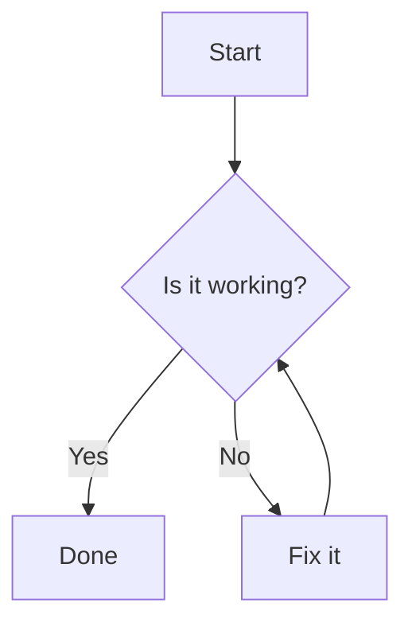
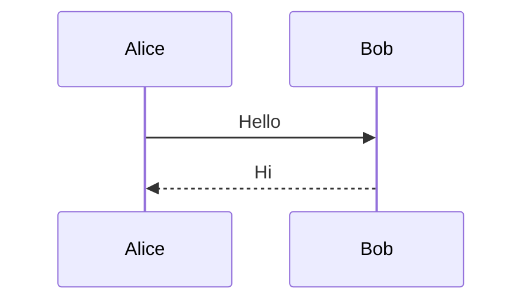

# Mermaid Markdown Bridge Demo


```mermaid
flowchart TD
  A[Start] --> B{Is it working?}
  B -->|Yes| C[Done]
  B -->|No| D[Fix it]
  D --> B
```


```mermaid
sequenceDiagram
  participant A as Alice
  participant B as Bob
  A->>B: Hello
  B-->>A: Hi
```

```kotlin
fun ordinaryCodeBlock() {
    println("This should stay a normal Markdown code block.")
}
```
